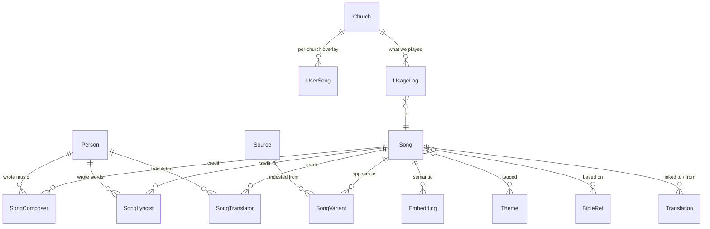

# SundaySong — Domain model

SundaySong's data model is built around two key ideas:

1. **One canonical `Song` per work.** "Amazing Grace" is ONE song, even
   though it appears in 50 different sources with 50 different
   arrangements.
2. **Many `SongVariant`s per Song.** Each variant comes from a specific
   source (Hymnary, salmebok, user upload) with its own attribution,
   licensing, and language.

This shape lets us link translations together, build cross-language
search, and produce both CCLI and TONO reports from one usage log.

## ERD



## Entities

### Source
Where a SongVariant came from. Hymnary.org, Norsk salmebok, CCLI partner
API, user upload, lovsang.no when partnership is signed.

| Column | Type | Notes |
|--------|------|-------|
| `id` | UUID PK | |
| `name` | TEXT | |
| `kind` | TEXT | `api`, `scrape`, `manual`, `user_upload` |
| `attribution_template` | TEXT | rendered for every variant |
| `last_sync_at` | TIMESTAMPTZ | |
| `enabled` | BOOL | |

### Person
| Column | Type | Notes |
|--------|------|-------|
| `id` | UUID PK | |
| `display_name` | TEXT | |
| `sort_name` | TEXT | |
| `birth_year`, `death_year` | INT | for PD-rule check |
| `nationality` | TEXT | |
| `external_ids` | JSONB | CCLI artist id, Spotify, Wikipedia |

### Song (canonical identity)
| Column | Type | Notes |
|--------|------|-------|
| `id` | UUID PK | |
| `canonical_title` | TEXT | best-known title in original language |
| `original_language` | TEXT | |
| `year_first_published` | INT | nullable |
| `copyright_status` | TEXT | `public_domain` / `copyrighted` / `unknown` |
| `ccli_song_id` | TEXT | nullable |
| `tono_work_id` | TEXT | nullable — Norwegian rights database |
| `tono_registered` | BOOL | |
| `hymnary_id` | TEXT | nullable |
| `popularity_score` | NUMERIC | computed, denormalized |
| `nordic_metadata` | JSONB | `{ salme_number, in_n13, copyright_status_no, ... }` |
| `themes` | TEXT[] | controlled vocab |
| `bible_refs` | TEXT[] | `["John:3:16", "Romans:8:28"]` |
| `created_at`, `updated_at` | TIMESTAMPTZ | |

### SongVariant (specific version from one source)
| Column | Type | Notes |
|--------|------|-------|
| `id` | UUID PK | |
| `song_id` | UUID FK | |
| `source_id` | UUID FK | |
| `source_external_id` | TEXT | source's own ID |
| `title` | TEXT | as appearing in source — may differ |
| `language` | TEXT | this variant's language |
| `key` | TEXT | when known |
| `bpm` | INT | when known |
| `meter` | TEXT | "8.7.8.7" hymn meter |
| `structure` | JSONB | `[{ "label": "verse_1", "lines": [...] }, ...]` |
| `lyrics_excerpt` | TEXT | first 2 lines (preview only) |
| `lyrics_url` | TEXT | link to full content |
| `chord_chart_url` | TEXT | |
| `audio_demo_url` | TEXT | |
| `attribution_required` | BOOL | |
| `attribution_text` | TEXT | rendered for display |
| `license_info` | TEXT | free text |
| `imported_at`, `last_verified_at` | TIMESTAMPTZ | |

### Translation (cross-language link)
| Column | Type | Notes |
|--------|------|-------|
| `id` | UUID PK | |
| `source_song_id` | UUID FK | the original |
| `target_song_id` | UUID FK | the translated work (itself a Song) |
| `relationship` | TEXT | `official` / `unofficial` / `adaptation` / `paraphrase` |
| `verified_by` | TEXT | `admin` / `community` / `ai_with_review` |
| `verified_at` | TIMESTAMPTZ | |

### Embedding (for semantic search)
| Column | Type | Notes |
|--------|------|-------|
| `id` | UUID PK | |
| `entity_type` | TEXT | `song` |
| `entity_id` | UUID | |
| `vector` | VECTOR(1024) | pgvector; model-dependent dim |
| `model_version` | TEXT | recompute on bump |

### UserSong (per-Sunday-account overlay)
| Column | Type | Notes |
|--------|------|-------|
| `church_id` | UUID FK | from sundayplan |
| `song_id` | UUID FK | composite PK |
| `preferred_key` | TEXT | |
| `private_notes` | TEXT | |
| `last_used_at` | TIMESTAMPTZ | denormalized from Stage / Plan usage |
| `was_streamed_count` | INT | for TONO streaming-tier counting |

### UsageLog (the foundation of CCLI + TONO reports)
| Column | Type | Notes |
|--------|------|-------|
| `id` | UUID PK | |
| `church_id` | UUID FK | |
| `song_id` | UUID FK | |
| `variant_id` | UUID FK | nullable |
| `service_date` | DATE | |
| `duration_displayed_sec` | INT | from Stage's cue advance |
| `was_streamed` | BOOL | crucial for TONO streaming-pool |
| `idempotency_key` | TEXT UNIQUE | from Stage to dedupe |
| `recorded_at` | TIMESTAMPTZ | |

## Five hardest queries

### Q1: "Norwegian translation of 'Amazing Grace'"

```sql
SELECT target.* FROM translation t
JOIN song target ON target.id = t.target_song_id
WHERE t.source_song_id = :amazing_grace_id
  AND target.original_language = 'no'
ORDER BY CASE t.relationship
  WHEN 'official' THEN 0 WHEN 'unofficial' THEN 1
  WHEN 'adaptation' THEN 2 WHEN 'paraphrase' THEN 3 END;
```

Trivial with proper indexing — `(source_song_id, target_lang)` covers it.

### Q2: Semantic search across all songs

```sql
WITH q_vec AS (
  SELECT :embedding::vector(1024) AS v
)
SELECT s.*, 1 - (e.vector <=> q_vec.v) AS sim
FROM embedding e
JOIN song s ON s.id = e.entity_id
CROSS JOIN q_vec
WHERE e.entity_type = 'song'
ORDER BY e.vector <=> q_vec.v
LIMIT 20;
```

HNSW index on `embedding.vector` → sub-50ms p95 on 100k songs.

### Q3: "Songs about communion in user's library, recently used"

```sql
SELECT s.*
FROM song s
JOIN user_song us ON us.song_id = s.id
WHERE us.church_id = :church_id
  AND 'communion' = ANY(s.themes)
ORDER BY us.last_used_at DESC NULLS LAST
LIMIT 20;
```

Uses GIN index on `song.themes`.

### Q4: CCLI report for Q2 2026

```sql
SELECT s.canonical_title, s.ccli_song_id, ul.service_date, COUNT(*) AS use_count
FROM usage_log ul
JOIN song s ON s.id = ul.song_id
WHERE ul.church_id = :church_id
  AND ul.service_date BETWEEN '2026-04-01' AND '2026-06-30'
  AND s.ccli_song_id IS NOT NULL
GROUP BY s.canonical_title, s.ccli_song_id, ul.service_date
ORDER BY service_date, s.canonical_title;
```

### Q5: TONO report — streamed vs in-room split

```sql
SELECT
  s.canonical_title,
  s.tono_work_id,
  STRING_AGG(DISTINCT to_char(ul.service_date, 'YYYY-MM-DD'), ', ') AS dates,
  SUM(CASE WHEN ul.was_streamed THEN 1 ELSE 0 END) AS streamed_count,
  SUM(CASE WHEN NOT ul.was_streamed THEN 1 ELSE 0 END) AS in_room_count
FROM usage_log ul
JOIN song s ON s.id = ul.song_id
WHERE ul.church_id = :church_id
  AND ul.service_date BETWEEN :from AND :to
  AND s.tono_work_id IS NOT NULL
GROUP BY s.canonical_title, s.tono_work_id
ORDER BY s.canonical_title;
```

This separation (streamed vs in-room) is what no American competitor does.

## Phase status (May 2026)

- [x] Phase 0.1 — Monorepo scaffolding
- [x] Phase 1.1 — Domain model (this document)
- [ ] Phase 1.2 — Migrations + repositories
- [ ] Phase 2 — Source connector framework + Hymnary import
- [ ] Phase 3 — Full-text + semantic search
- [ ] Phase 4 — Transposition + translation lookup + recommendations
- [ ] Phase 5 — Public API + TypeScript SDK
- [ ] Phase 6 — sundaysong.com browse
- [ ] Phase 7 — Sunday-suite integration + **CCLI + TONO reporting**
- [ ] Phase 8 — User contributions
- [ ] Phase 9 — Beta launch
